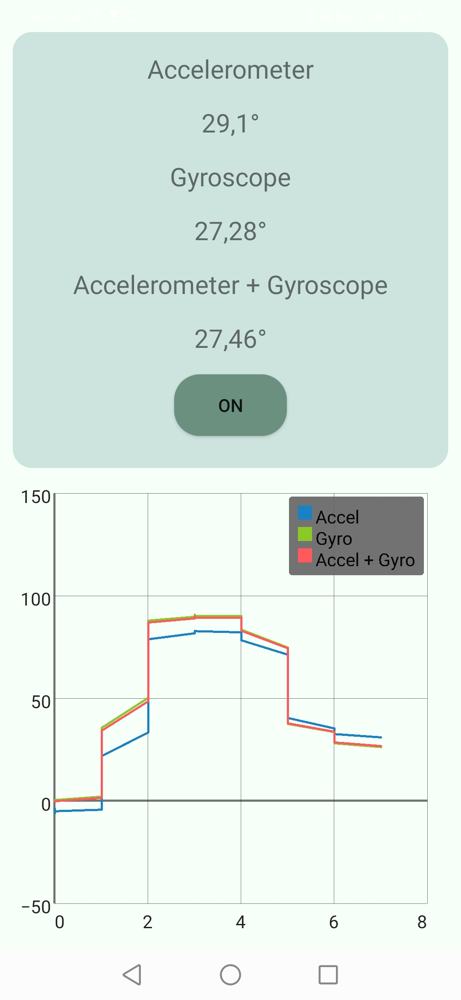

# Internal Sensors App

As an electrical engineering student, I developed this Android application as part of a course on mobile applications and wireless networks at Kungliga Tekniska Högskolan.

The app utilizes the internal gyroscope sensor and accelerometer to measure and display the current angle of the device, providing a useful tool for a variety of applications. In addition, the GraphView API is leveraged to graph the measurements taken over a set time period, giving users a visual representation of the data.

To ensure that the data is easily accessible and reusable, the app saves the measurements to a JSON file. This makes it easy for users to export and analyze the data using external tools.

The app is built using the Model-View-Controller (MVC) architectural pattern, providing a well-organized structure for the codebase. This approach helps to separate the concerns of the application, making it easier to maintain and modify.

While the implementation of MVC may not be perfect in all aspects of the app, the project has provided me with valuable experience in applying design patterns to real-world development challenges.

  

